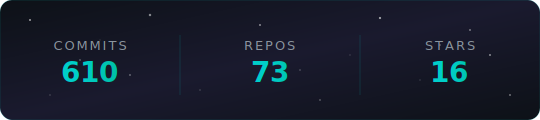

<picture>
  <source media="(prefers-color-scheme: dark)" srcset="https://capsule-render.vercel.app/api?type=waving&color=0:0d1117,50:1a1a2e,100:00cec9&height=220&section=header&text=COSMOS%20%F0%9F%8C%8C&fontSize=50&fontColor=ffffff&animation=fadeIn&fontAlignY=35&desc=Building%20intelligent%20systems%20on%20Azure%20Cloud&descSize=16&descColor=cccccc&descAlignY=55" />
  <source media="(prefers-color-scheme: light)" srcset="https://capsule-render.vercel.app/api?type=waving&color=0:2d3436,50:1a1a2e,100:00cec9&height=220&section=header&text=COSMOS%20%F0%9F%8C%8C&fontSize=50&fontColor=ffffff&animation=fadeIn&fontAlignY=35&desc=Building%20intelligent%20systems%20on%20Azure%20Cloud&descSize=16&descColor=eeeeee&descAlignY=55" />
  
</picture>

# Gonçalo L. Fernandes

---

`AI/ML Developer`

[](https://linkedin.com/in/gonzalo-aiml-dev)

---

```yaml
name: Gonçalo L. Fernandes
located_in: Porto, Portugal
job: AI/ML Developer @ COSMOS-OMNI
fields_of_work: ["Azure AI", "MLOps", "OCR", "Computer Vision", "Deep Learning", "GenAI", "NLP"]
tech_stack: ["Azure Cloud", "Python", "YOLOv8", "PyTorch", "FastAPI"]
currently_building: ["Multi-Model Invoice Systems", "Drone-Based Warehouse Auditing"]
fun_fact: "Production AI since age 20 🚀"
```

---

AI/ML Developer building production-grade intelligent systems on Azure Cloud. I design, train, and deploy AI pipelines that process real enterprise data — specializing in multi-model financial document processing with OCR, NLP, and GenAI for B2B enterprise clients across European markets.

Currently expanding into Computer Vision and Deep Learning, developing custom product detection and fine-tuning pipelines with real client data.

---

### 🧰 Languages and Tools

<p>
  &nbsp;
  &nbsp;
  &nbsp;
  &nbsp;
  &nbsp;
  &nbsp;
  &nbsp;
  &nbsp;
  &nbsp;
  &nbsp;
  &nbsp;
  &nbsp;
  &nbsp;
  &nbsp;
</p>

---

<p align="center">
  
</p>

---

<picture>
  <source media="(prefers-color-scheme: dark)" srcset="https://capsule-render.vercel.app/api?type=waving&color=0:00cec9,50:1a1a2e,100:0d1117&height=100&section=footer" />
  <source media="(prefers-color-scheme: light)" srcset="https://capsule-render.vercel.app/api?type=waving&color=0:00cec9,50:1a1a2e,100:2d3436&height=100&section=footer" />
  
</picture>
