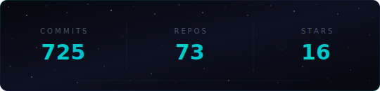

<div align="center">
  <a href="#"></a>
</div>

###

<h3 align="center">• • •</h3>

###

<div>

```yaml
name: Gonçalo L. Fernandes
located_in: Porto, Portugal
job: AI/ML Developer @ COSMOS-OMNI
fields_of_work: ["Azure AI", "MLOps", "OCR", "Computer Vision", "Deep Learning", "GenAI", "NLP"]
tech_stack: ["Azure Cloud", "Python", "YOLOv8", "PyTorch", "FastAPI"]
currently_building: ["Multi-Model Invoice Systems", "Drone-Based Warehouse Auditing"]
fun_fact: "Production AI since age 20 🚀"
```

</div>

###

<h3 align="center">• • •</h3>

###

AI/ML Developer building production-grade intelligent systems on Azure Cloud. I design, train, and deploy AI pipelines that process real enterprise data — specializing in multi-model financial document processing with OCR, NLP, and GenAI for B2B enterprise clients across European markets.

Currently expanding into Computer Vision and Deep Learning, developing custom product detection and fine-tuning pipelines with real client data.

###

<h3 align="center">• • •</h3>

###

<div align="center">
  &nbsp;&nbsp;
  &nbsp;&nbsp;
  &nbsp;&nbsp;
  &nbsp;&nbsp;
  &nbsp;&nbsp;
  &nbsp;&nbsp;
  &nbsp;&nbsp;
  &nbsp;&nbsp;
  &nbsp;&nbsp;
  &nbsp;&nbsp;
  &nbsp;&nbsp;
  &nbsp;&nbsp;
  &nbsp;&nbsp;
  
</div>

###

<h3 align="center">• • •</h3>

###

<div align="center">
  <a href="#"></a>
</div>

###

<h3 align="center">• • •</h3>

###

<div align="center">
  <a href="https://linkedin.com/in/gonzalo-aiml-dev" target="_blank">
    
  </a>
</div>

###

<div align="center">
  <a href="#"></a>
</div>
